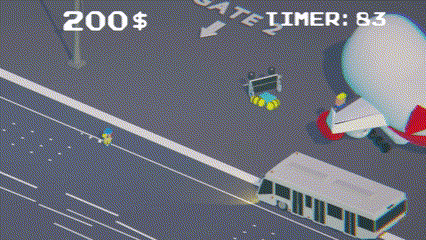
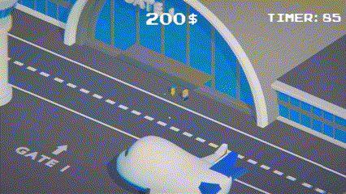

# AirportDeliveryGuy
In AirportDeliveryGuy, players step into the role of an airport worker with the task of moving passengers and luggage to their respective planes. With unique power-ups, various vehicles, this game captures the fast-paced world of airport logistics.

## Goal
Help passengers reach their flights and ensure safe delivery of luggage on the respective plane. Deliver passengers and baggage to maximize your score and receive money to purchase [**Power-Ups**](#Power-Ups:) and [**Vehicles**](#Vehicles:).

## Challenges 
Navigate through the airport, and avoid obstacles like busses and planes while delivering.

## Interactions
Guide passengers using vehicles and power-ups to speed up transport.

Load luggage onto planes using vehicles or throw them directly onto conveyor belts.

# Power-Ups:
### Speed Boost
Increases movement speed, allowing for faster transport of passengers or luggage.

### Strength
Increases carrying capacity, allowing the player to transport multiple luggage or passengers at once.

### Magnetism
Attracts nearby luggage, making it easier to collect items without direct contact.

# Vehicles:
### Cart
Basic vehicle with low speed, suitable for short distances.

### Kart
The Fastest vehicle, ideal for agile and large movements of luggage.

### Bus
High capacity, best for transporting large numbers of passengers over longer distances.

##
This game was created for 6 days game Jam theme Travel
